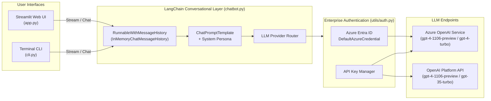
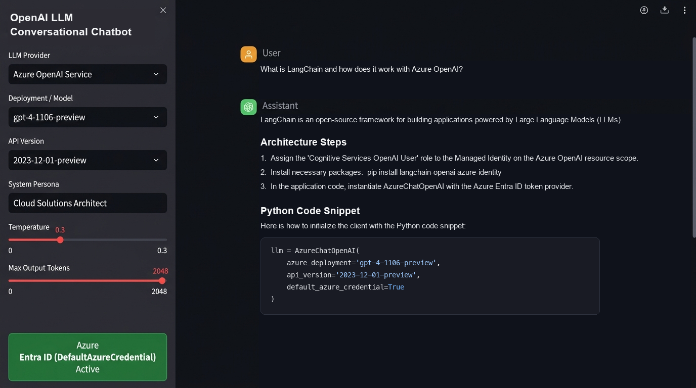

# OpenAI LLM Conversational Chatbot (`openai-llm-chatbot`)

An enterprise-grade conversational AI assistant built with **Python**, **Azure OpenAI Service / OpenAI API**, **LangChain (`AzureChatOpenAI` & `RunnableWithMessageHistory`)**, **Azure Entra ID (`DefaultAzureCredential`)**, and **Streamlit**.

---

## Key Features

- **Dual Enterprise Authentication**: Seamlessly authenticates using **Azure Entra ID (Azure AD)** Managed Identity (`DefaultAzureCredential` + `get_bearer_token_provider`) or Azure OpenAI / OpenAI API Keys.
- **Stateful Multi-Turn Memory**: Uses LangChain's `RunnableWithMessageHistory` and `InMemoryChatMessageHistory` to maintain isolated session context across multi-turn conversations.
- **Real-Time Token Streaming**: Streams LLM tokens directly into the Streamlit Web UI and CLI interface for low-latency responsiveness.
- **Role-Based System Personas**: Switch dynamically between *Cloud Solutions Architect*, *Python AI Engineer*, *DevOps & SRE Specialist*, and *General Enterprise Assistant*.
- **Offline / Demo Simulation Mode**: Automatically activates a realistic architectural simulation fallback when run without live API keys, ensuring immediate UI and CLI testing out of the box.

---

## System Architecture



### ASCII Architecture Overview

```text
+-----------------------------------------------------------------------+
|                    User Interfaces (Streamlit / CLI)                  |
|         [app.py: Web Chat UI]         [cli.py: Terminal Chat]         |
+-----------------------------------+-----------------------------------+
                                    |
                                    v
+-----------------------------------------------------------------------+
|              LangChain Orchestration Engine (chatbot.py)              |
|  +------------------------+       +--------------------------------+  |
|  | ChatPromptTemplate     | <---> | RunnableWithMessageHistory     |  |
|  | (Role Persona System)  |       | (In-Memory Session Isolation)  |  |
|  +------------------------+       +--------------------------------+  |
+-----------------------------------+-----------------------------------+
                                    |
                                    v
+-----------------------------------------------------------------------+
|              Authentication & Security Layer (utils/auth.py)          |
|   [Azure Entra ID DefaultAzureCredential]   [API Key Authentication]  |
+-----------------------------------+-----------------------------------+
                                    |
                                    v
+-----------------------------------------------------------------------+
|                      Cloud LLM Model Endpoints                        |
|        [Azure OpenAI Service (gpt-4-1106-preview)]       [OpenAI Platform API]    |
+-----------------------------------------------------------------------+
```

---

## Chatbot Web UI Screenshot



---

## Project Structure

```text
openai-llm-chatbot/
├── assets/
│   └── chatbot_ui_screenshot.png   # Streamlit Chatbot UI screenshot
├── tests/
│   └── test_chatbot.py             # Unit test suite for config, memory, and personas
├── utils/
│   ├── __init__.py                 # Auth utilities package exports
│   └── auth.py                     # Azure Entra ID and API key credential validation
├── .env.example                    # Environment variable template
├── .gitignore                      # Git ignore rules
├── app.py                          # Streamlit interactive web chat application
├── chatbot.py                      # Core LangChain AzureChatOpenAI conversational engine
├── cli.py                          # Interactive command-line chat interface
├── config.py                       # Centralized configuration and persona presets
├── Dockerfile                      # Container deployment definition
├── README.md                       # Project documentation and execution steps
└── requirements.txt                # Python dependencies
```

---

## Step-by-Step Execution Guide

### 1. Navigate to Project Directory & Create Virtual Environment

```bash
cd /Users/khansaddam/Workspaces/JetSki/GenAI/openai-llm-chatbot
python3 -m venv .venv
source .venv/bin/activate
```

### 2. Install Dependencies

```bash
pip install --upgrade pip
pip install -r requirements.txt
```

### 3. Configure Environment Variables

Copy the example `.env.example` file to `.env` and populate your Azure OpenAI or OpenAI credentials:

```bash
cp .env.example .env
```

Example `.env` configuration for Azure OpenAI:

```ini
LLM_PROVIDER=azure_openai
AZURE_OPENAI_API_KEY=your-azure-openai-api-key
AZURE_OPENAI_ENDPOINT=https://your-resource-name.openai.azure.com/
AZURE_OPENAI_DEPLOYMENT_NAME=gpt-4-1106-preview
AZURE_OPENAI_API_VERSION=2023-12-01-preview
USE_AZURE_AD_AUTH=false
LLM_TEMPERATURE=0.3
LLM_MAX_TOKENS=2048
```

*(Note: If you run the application without configuring `.env`, the chatbot automatically runs in **Simulation Mode** so you can immediately test the UI, streaming, and persona memory without an active cloud subscription).*

### 4. Run the Streamlit Web UI

```bash
streamlit run app.py
```

Open your browser at `http://localhost:8501` to interact with the Chatbot UI.

### 5. Run the Interactive Terminal CLI

```bash
python3 cli.py
```

### 6. Run Unit Tests

```bash
python3 -m unittest discover -s tests -v
```

### 7. Run with Docker (Optional)

```bash
docker build -t openai-llm-chatbot:latest .
docker run -p 8501:8501 --env-file .env openai-llm-chatbot:latest
```
